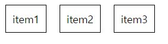

# 🍎인스타그램을 만들며 배워보는 Vue.js 3 완벽 가이드
> **tutor**: 코딩애플  
> link: [coding apple](https://codingapple.com/course/vue-js/)
---
  <p align="center"></p>  
  
## 목차  
1. PART1  
1-1. [Vue의 데이터바인딩](#1\-1-Vue의-데이터바인딩)  
1-2. [Vue의 반복문 v-for](#1\-2-Vue의-반복문-v\-for)  
1-3. [Vue 이벤트 핸들러](#1\-3-Vue의-이벤트-핸들러)  
1-4. [Vue의 조건문 v-if](#1\-4-Vue의-조건문-v\-if)  
1-5. [import/export](#1\-5-importexport)  
1-6. [모달창 만들기](#1\-6-모달창-만들기)  
1-7. [컴포넌트(Component)](#1\-7-컴포넌트component)  
1-8. [Props](#1\-8-Props)  
1-9. [Custom Event](#1\-9-Custom-Event)  
1-10. [Vue에서 사용자의 데이터 받기 v-model](#1\-10-Vue에서-사용자의-데이터-받기-v\-model)  
1-11. [감시자 Watcher](#1\-11-감시자-Watcher)  
1-12. [Vue에서 UI 애니메이션 주기](#1\-12-Vue에서-UI-애니메이션-주기)  
1-13. [상품정렬기능, 데이터 원본 보존](#1\-13-상품정렬기능-데이터-원본-보존)  
1-14. [Vue의 라이프사이클과 후크](#1\-14-Vue의-라이프사이클과-후크)  
2. PART2  
<br/>

  ---  
  
<br/>  

# 1-1. Vue의 데이터바인딩
**데이터바인딩**이란 자바스크립트 변수나 데이터를 HTML에 꽂아넣는 것을 말합니다.  
  
<br/>  
  
> **자바스크립트**의 데이터 바인딩  
1. document.getElementBy()와 같은 js문법을 사용하여 class 혹은 id 값을 입력합니다.
2. innerHtml을 사용하여 선택된 HTML 안에 값을 대입합니다.  

```Html
<html>
    <script>
        document.getElementBy(".title").innerHtml = 제목입니다.;
    </script>
    
    <body>
        <h1 class="title"></h1>
    </body>
</html>
```
<br/>  

> **Vue**의 데이터바인딩  
1. 데이터를 먼저 보관하고  
2. {{ 데이터 }} <- 이런식의 문법으로 HTML 태그 사이에 끼워넣습니다.  

```html
<script>
export default {
    data(){
        return {
            title : '제목입니다.',
        }
    }
}
</script>

<template>
    <div>{{ title }}</div>
</template>
```  
<br/>

> 결과

<p align="left"></p>  

<br/>

> HTML의 **속성**도 데이터바인딩이 가능합니다.  

```html
<script>
export default {
  data() {
    return {
      whiteBoxCss :
          'background-color: white; ' +
          'border: 1px solid black;' +
          'width: 100px;' +
          'height: 50px;' +
          'margin: 10px 0 0 10px;' +
          'text-align: center;'
    }
  }
}
</script>

<template>
  <div class="white-box" :style="whiteBoxCss">
    <p>안녕하세요.</p>
  </div>
</template>
```

> 결과

<p align="left"></p>  

<br/>

---

<br/>

# 1-2. Vue의 반복문 v-for  

<details>
<summary>내용 보기</summary>

```html
<div class="menu">
    <a v-for="[작명] in 3" :key="[작명]">Home</a>
</div>
```
<br/>
이해를 돕기위해 Java의 for-eatch문과 같이 설명해보겠습니다.

v-for문은 Java의 for-eatch문과 비슷하게 작동한다고 생각하면 좋을것 같습니다.  

> Java의 향상된 for문(for-eatch)  
```Java
List<String> itemList = new ArrayList<>(){
    add("Hello")
    add("World")
    add("!!!!")
};

for(item : itemList) {
    System.out.println(item);
}

//출력:
//Hello
//World
//!!!!
```  
<br/>
Java의 향상된 for문(for-eatch)은 item이라는 변수를 for문과 같이 작성하고  
itemList라는 list의 값을 하나씩 item에 대입하여 반복문 내부의 코드를 실행시키는 구조입니다.  
<br/>
item과 itemList는 변수명, 리스트명이며 마음대로 작명할 수 있습니다.  
<br/>
<br/>
Vue의 반복문 v-for도 이와 같은 원리로 [작명] 부분이 변수를 선언하는 부분이며  
'3' 부분에 반복할 수 또는 List와 같은 배열을 넣을 수 있습니다.  
<br/>
따라서 반복되는 수 '3'를 넣은 경우 들어간 데이터([작명])가 3번 반복되며
List를 넣은경우는 데이터에 List안의 값이 순서대로 들어가며 List.length() 만큼 반복됩니다.

```html
<script>
export default {
  data() {
    return {
      itemList: ['item1', 'item2', 'item3'],
    }
  }
}
</script>

<template>
  <br/>
  <div class="item-box">
    <a style="width: 100px; height: 50px; border: 1px solid black; padding: 10px; margin: 10px;"
      v-for="item in itemList" :key="item">{{ item }}</a>
  </div>
</template>

<style>

</style>
```  

> 결과

<p align="left"></p>  

<br/>

</details>

<br/>  

---

<br/>  

# 1-3. Vue의 이벤트 핸들러

<details>
<summary>내용 보기</summary>

### 버튼을 누르면 기능을 실행하고 싶은 경우

> **자바스크립트**의 경우

```html
<script>
function hello() {
    alert("안녕하세요");
}
</script>

<body>
    <button onclick="hello()">Say Hello!!</button>
</body>
```
   
<br/>   
   
> **Vue**의 경우

```html
<div>
  <button @click="alert('안녕하세요.')">Say Hello!!</button>
</div>
```

<br/>

클릭했을때 실행되는 **@click**이외에 마우스를 올렸을때 실행되는 **@mouseover**
인풋값에 값을 입력할때마다 실행되는 **@input** 등 많은 이벤트 핸들러도 만들 수 있습니다.   
   
또한 실행되어야 하는 코드가 길 경우 함수로 만들어서 사용할 수도 있습니다.

> 예제

```html
<script>
export default {
    data(){
      return {
        reportCount : 0,
      },
    },
    methods : { 
      increase(){ 
        <!--methods에서 선언된 함수에서 data()에 선언된 변수를 사용하려면 꼭 this.을 앞에 붙여야합니다.-->
        this.reportCount += 1 
      } 
    }
}

</script>
<template>
    <div>
      <button @click="increase()")">REPORT!</button>
      <span>신고수: {{ reportCount }}</span>
    </div>
</template>
```

</details>

<br/>

---

<br/>

# 1-4. Vue의 조건문 v-if

<details>
<summary>내용 보기</summary>

Vue에서의 조건문은 태크안에 속성으로 들어갑니다.
```html
<div class="modal" v-if="modalStatus == true">
```
   
   만약 조건식의 반환값이 true라면 해당 태그는 노출되고 그렇지 않다면 아예 보이지 않습니다.
   
   > 실제 사용 예제
   ```html
    <script>
        export default(){
            data() {
                return{
                    modalStatus: true,
                }
            }
        }
    </script>
    
    <template>
        <div class="black-bg" v-if="modalStatus == true">
          <div class="white-bg">
            <h4>상세페이지</h4>
            <p>상세페이지내용임</p>
            <button @click="modalStatus = false">모달창 닫기</button>
          </div>
        </div>
    </template>
   ```
   
   </details>
   
   <br/>
   
   ---
   
   <br/>
   
# 1-5. import/export
<details>
<summary>내용 보기</summary>  

Html에서는 보편적으로 html, css, js가 전부 들어가면 코드가 너무 길어지기 때문에 파일을 분리합니다.   
그럴때 쓰이는것이 import(불러오기)/export(내보내기)입니다.   

자바스크립트에서 사용법과 Vue에서의 차이점을 알아봅시다.   

> 자바스크립트에서의 import / export
```js
//선언부 앞에 export 붙이기

// 📁 say.js
export function sayHi() { ... }
export function sayBye() { ... }
export function becomeSilent() { ... }

// 📁 main.js
import {sayHi, sayBye} from './say.js';
```

<br/>

> Vue에서의 import / export
```js
//📁 say.js
export default sayHi() { ... }
```
```html
<!--📁 App.vue-->
<script>
import [작명] from './say.js';
</script>
```
Vue는 export default 옆에 내보낼 변수나 자료형을 입력하면 됩니다.   
1. export default는 파일 맨마지막에 딱 한번 사용가능하고   
2. import시 작명은 자유롭게 가능합니다.   


> Vue에서의 import / export{} 문법
```js
// 📁 apple.js
let apple = 10;
let apple2 = 100;
export {apple, apple2}
```
```html
<!--📁 App.vue-->
import [작명] from './apple.js';
</script>
```

1. export는 원하는 만큼 사용할 수 있습니다.   
2. export{}문법으로 받아올 시에는 작명이 불가능하고 export 했던 변수 혹은 함수명을 그래도 적어야합니다.

### import로 받아온 데이터 사용하는 법
```html
<!--📁 App.vue-->
<script>
import data from './oneroom.js파일경로'

data(){
  return {
    data : data //data는 방 정보가 담겨있는 배열이라고 생각해봅시다.
  }
}
</script>

<template>
    <div>
      <h4>{{data[0].title}}</h4>
      <p>{{data[0].price}}</p>
    </div>
</template>
```

</details>

<br/>

---

<br/>

# 1-6. 모달창 만들기

<details>
<summary>내용 보기</summary>

저희는 예전에 [1-4. Vue의 조건문 v-if](#1\-4-Vue의-조건문-v\-if) 에서 간단히 모달창을 만들어 본적이 있습니다.

> 이전 코드 예제

```
 <script>
     export default(){
         data() {
             return{
                 modalStatus: true,
             }
         }
     }
 </script>
 
 <template>
     <div class="black-bg" v-if="modalStatus == true">
       <div class="white-bg">
         <h4>상세페이지</h4>
         <p>상세페이지내용임</p>
         <button @click="modalStatus = false">모달창 닫기</button>
       </div>
     </div>
 </template>
```

위 코드를 **첫째 상품을 누르면 첫째 상품의 제목, 가격, 설명**
**둘째 상품을 누르면 둘째 상품의 제목, 가격, 설명**
...
이런식으로 코드를 변경해 봅시다.

```html
 <script>
     export default(){
         /*
         data() : 코드에서 쓰일 변수들을 선언 및 저장해놓는 공간입니다.   
            modalStatus: 모달창이 열려야하는지 확인하기 위해 필요한 변수입니다.   
            products: 상품 정보 데이터를 저장시켜 놓은 2차원 배열입니다.
            <!--데이터같이 많은 코드를 필요로 하는 코드는 따로 분리하여 import를 해오면 좋습니다.-->
            modalSelect: 어떤 상품을 선택했는지 구분하기 위해 필요한 변수입니다.
        */
         data() {
             return{
                 modalStatus: true,
                 products: {
                     [id: 0, title: "sweet home", price: 10000, content: "스위트홈. 귀신 출몰 주의", image: "https://www.urbanbrush.net/web/wp-content/uploads/edd/2022/12/urbanbrush-20221214144619159434.jpg"],
                     [id: 1, title: "goat home", price: 850000, content: "-GOAT-", image: "https://www.urbanbrush.net/web/wp-content/uploads/edd/2022/12/urbanbrush-20221214144619159434.jpg"],
                     [id: 2, title: "faker home", price: NaN, content: "감히 범접하려 들지 말라", image: "https://upload3.inven.co.kr/upload/2023/11/12/bbs/i15093764331.png?MW=800"]
                 },
                 modalSelect: 0,
             }
         }, 
     }
 </script>
 
 <template>
    <!-- 모달 창-->
  <div class="black-bg" v-if="modalStatus == true">
    <div class="white-bg">
      <h4>{{ products[].title }}</h4>
      <p>{{ products[].content }}</p>
      <p>{{ products[].price }}원</p>
      <button @click="modalStatus = false">모달창 닫기</button>
    </div>
  </div>
 
  <!--product_card가 products.length만큼 생성됩니다.-->
  <div class="product_card" v-for="(product,i) in products" :key="product" :product="products[i]">
    
    <!--@click 이벤트리스터를 통해 클릭했을때 modalStatus가 true, modalSelect에 i(인덱스)가 들어가게 됩니다.-->
    <h4 @click = "modalStatus = true; modalSelect = i")>{{ product.title }}</h4>
    <p>{{ product.price }}원</p>
  </div>
 </template>
```
    
> 결과

<p align="center"></p>  

<br/>

</details>

<br/>

---

<br/>

# 1-7. 컴포넌트(Component)
<details>

<summary>내용 보기</summary>

### 컴포넌트란
**원하는 HTML 덩어리를 한 글자로 축약**할 수 있게 도와주는 문법입니다.   
<br/>

컴포넌트를 만드는 방법은 html에서 css와 js를 파일을 분리시켜 import, export 해오는 것과 같은 원리입니다.
example.vue 파일을 아무데너 만든 후 축약할 HTML을 붙여넣어주면 됩니다.


앞서 작성한 모달창과 카드를 같이 가지고 있는 코드를 들고와 컴포넌트를 적용시켜 봅시다.   
```html
 <script>
     export default(){
         data() {
             return{
                 modalStatus: true,
                 products: {
                     [id: 0, title: "sweet home", price: 10000, content: "스위트홈. 귀신 출몰 주의", image: "https://www.urbanbrush.net/web/wp-content/uploads/edd/2022/12/urbanbrush-20221214144619159434.jpg"],
                     [id: 1, title: "goat home", price: 850000, content: "-GOAT-", image: "https://www.urbanbrush.net/web/wp-content/uploads/edd/2022/12/urbanbrush-20221214144619159434.jpg"],
                     [id: 2, title: "faker home", price: NaN, content: "감히 범접하려 들지 말라", image: "https://upload3.inven.co.kr/upload/2023/11/12/bbs/i15093764331.png?MW=800"]
                 },
                 modalSelect: 0,
             }
         }, 
     }
 </script>
 
 <template>
  <div class="black-bg" v-if="modalStatus == true">
    <div class="white-bg">
      <h4>{{ products[].title }}</h4>
      <p>{{ products[].content }}</p>
      <p>{{ products[].price }}원</p>
      <button @click="modalStatus = false">모달창 닫기</button>
    </div>
  </div>

  <div class="product_card" v-for="(product,i) in products" :key="product" :product="products[i]">
    
    <h4 @click = "modalStatus = true; modalSelect = i")>{{ product.title }}</h4>
    <p>{{ product.price }}원</p>
  </div>
 </template>
```


</details>

<br/>

---

<br/>

# 1-8. Props
<details>

<summary>내용 보기</summary>

//...

</details>

<br/>

---

<br/>


# 1-9. Custom Event
<details>

<summary>내용 보기</summary>

//...

</details>

<br/>

---

<br/>


# 1-10. Vue에서 사용자의 데이터 받기 v-model
<details>

<summary>내용 보기</summary>

//...

</details>

<br/>

---

<br/>


# 1-11. 감시자 Watcher
<details>

<summary>내용 보기</summary>

//...

</details>

<br/>

---

<br/>


# 1-12. Vue에서 UI 애니메이션 주기
<details>

<summary>내용 보기</summary>

//...

</details>

<br/>

---

<br/>


# 1-13. 상품정렬기능, 데이터 원본 보존
<details>

<summary>내용 보기</summary>

//...

</details>

<br/>

---

<br/>


# 1-14. Vue의 라이프사이클과 후크
<details>

<summary>내용 보기</summary>

//...

</details>

<br/>

---

<br/>
